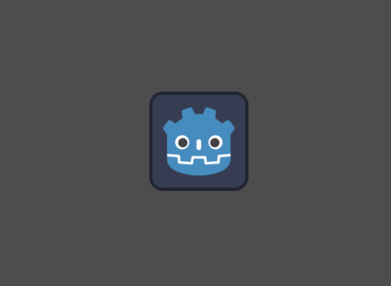

# Play Centered

A Godot editor plugin. When running a scene that doesn't have a
camera, it will be displayed centered as in the editor viewport
instead of at the top-left corner.

## Motivation

How many times have you seen this while editing a project in Godot?

When you actually wanted this:

It happens often when playing a scene that is meant to be instanciated
from another scene. But sometimes you want to play them in isolation
and you expect to see more-or-less what's in the viewport, not the
bottom-right quarter of it.

Note: Godot has a great debugging tool **Project Camera Override** in
the editor viewport toolbar. The problem is that it has to be
activated every time, switching back to the editor. This plugin is all
about enabling the camera override automatically if:
- Is not the main scene.
- Is not a Control scene.
- The scene doesn't have a camera.

## Demo

[Showcase video.](https://github.com/manuq/godot_addon_play_centered/assets/83944/59904622-f015-4dcd-b2d5-6d903857e5ca)

## Installation

Install it from the [Asset Library](https://godotengine.org/asset-library/asset/2883).

If you've downloaded this manually, do the following:

- Ensure you're using **Godot 4.2 or above**
- Find the `addons` folder in your project files, or create it if it doesn't exist yet.
- Move the folder `addons/play_centered` to your project's `addons` folder.
- Enable Play Centered under `Project > Project Settings > Plugins`

## Licence

Licensed under the MIT license, see [LICENSE](./LICENSE) for more information.
